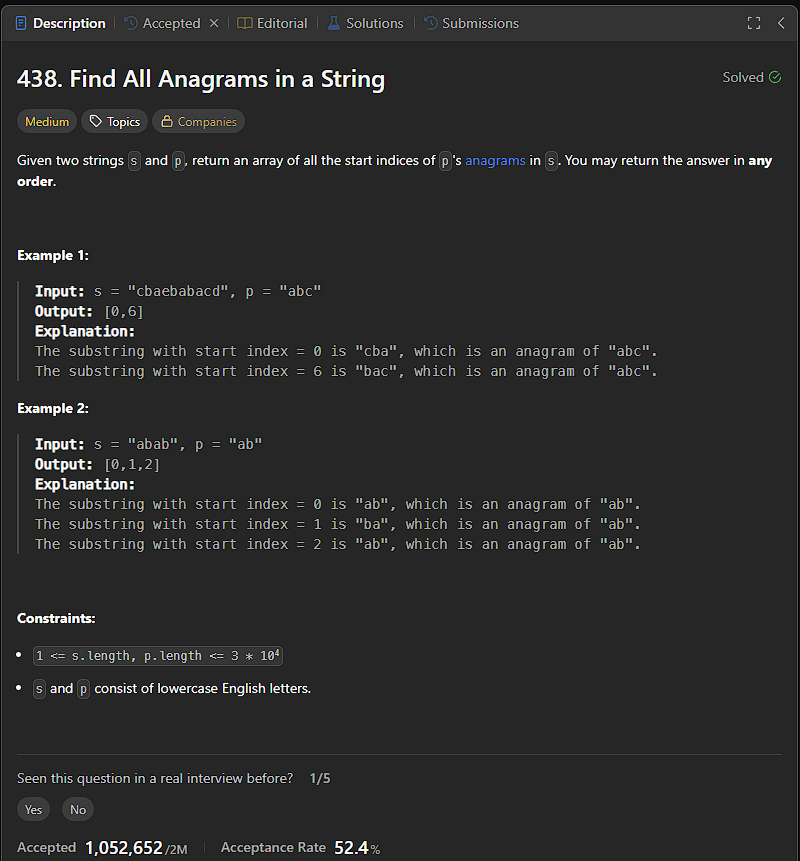

```
var findAnagrams = function (s, p) {
    if (s.length < p.length) {
        return []
    }
    let result = []
    let pFreq = {}, sFreq = {};

    for (const char of p) {
        pFreq[char] = (pFreq[char] || 0) + 1
    }

    for (let i = 0; i < p.length; i++) {
        sFreq[s[i]] = (sFreq[s[i]] || 0) + 1
    }

    const isEqual = (a, b) => {
        if (Object.keys(a).length !== Object.keys(b).length) {
            return false
        }

        for (let key in a) {
            // console.log(key, a[key], " ", b[key])
            if (a[key] !== b[key]) {
                return false
            }
        }
        return true
    }

    if (isEqual(sFreq, pFreq)) {
        result.push(0)
    }

    for (let i = p.length; i < s.length; i++) {
        let startChar = s[i - p.length];
        let endChar = s[i]

        sFreq[startChar]--;
        if (sFreq[startChar] === 0) {
            delete sFreq[startChar]
        }

        sFreq[endChar] = (sFreq[endChar] || 0) + 1;

        if (isEqual(sFreq, pFreq)) {
            result.push(i - p.length + 1)
        }
    }

    return result
};
```