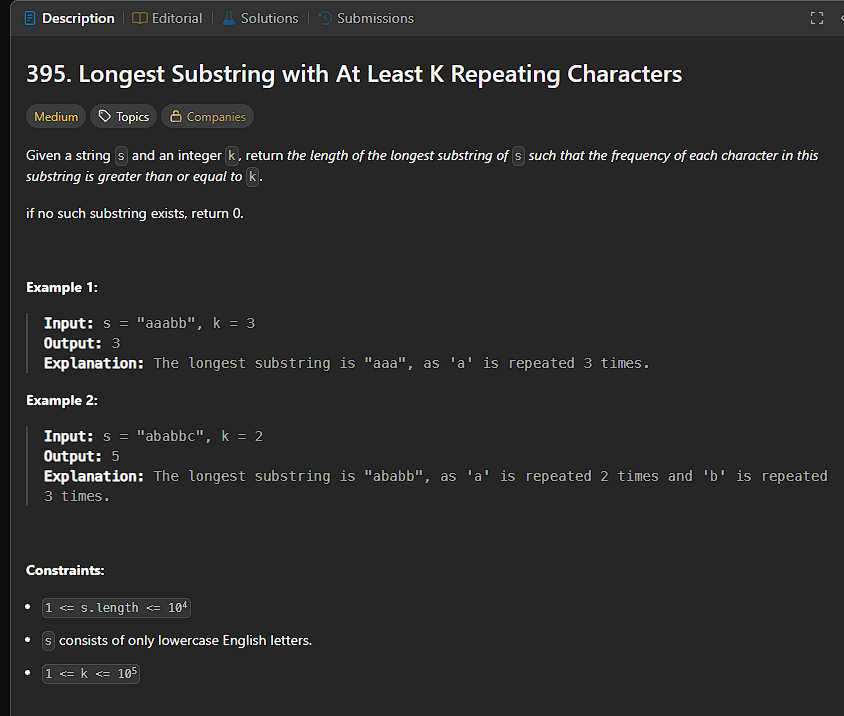

```
function longestSubstring(s, k) {
  let maxLen = 0;

  // Try every possible number of unique characters
  for (let uniqueTarget = 1; uniqueTarget <= 26; uniqueTarget++) {
    let freq = Array(26).fill(0);
    let left = 0, right = 0;
    let uniqueCount = 0;
    let countAtLeastK = 0;

    while (right < s.length) {
      const rIdx = s.charCodeAt(right) - 97;

      // Expand window
      if (freq[rIdx] === 0) uniqueCount++;
      freq[rIdx]++;
      if (freq[rIdx] === k) countAtLeastK++;
      right++;

      // Shrink window if too many unique chars
      while (uniqueCount > uniqueTarget) {
        const lIdx = s.charCodeAt(left) - 97;
        if (freq[lIdx] === k) countAtLeastK--;
        freq[lIdx]--;
        if (freq[lIdx] === 0) uniqueCount--;
        left++;
      }

      // Update result
      if (uniqueCount === countAtLeastK) {
        maxLen = Math.max(maxLen, right - left);
      }
    }
  }

  return maxLen;
}

```