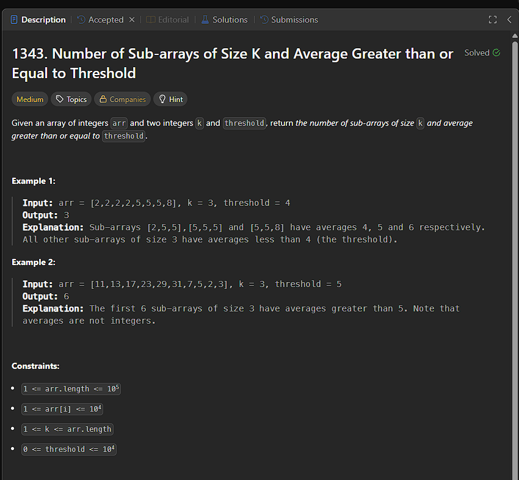

```
const findAverage = (left, right, arr, k) => {
    let sum = 0;
    while (left <= right) {
        sum += arr[left++]
    }
    return Math.floor(sum / k)
}

var numOfSubarrays = function (arr, k, threshold) {
    let left = 0;
    let count = 0;

    for (let right = k - 1; right < arr.length; right++) {
        if (threshold <= findAverage(left, right, arr, k)) {
            count++;
        }
        left++;
    }
    return count
};
```

## OPTIMAL APPROACH
```
var numOfSubarrays = function (arr, k, threshold) {
    let windowSum = 0;
    let count = 0;
    let target = k * threshold;

    for (let i = 0; i < k; i++) {
        windowSum += arr[i]
    }

    if (windowSum >= target) {
        count++
    }

    for (let i = k; i < arr.length; i++) {
        windowSum += arr[i] - arr[i - k]
        if (windowSum >= target) {
            count++
        }
    }
    return count
};
```